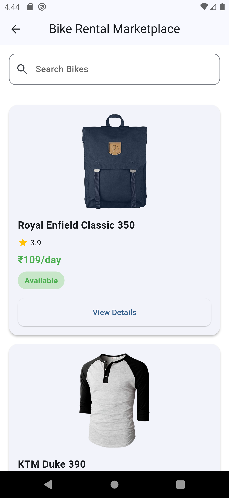
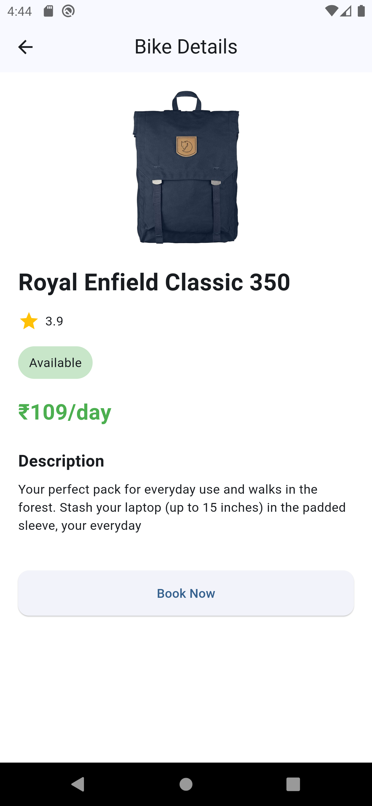
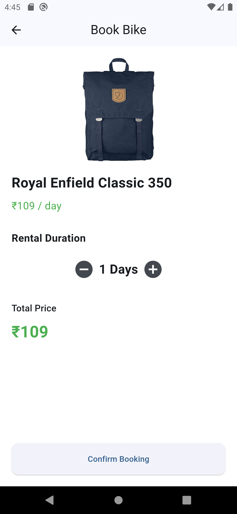
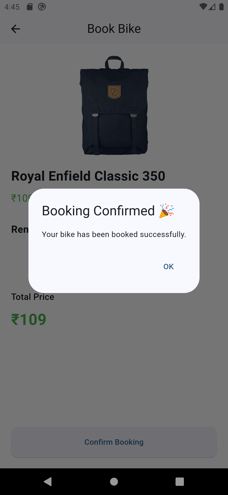

# 🚲 Bike Rental Marketplace

A Flutter application built as part of an internship assignment that demonstrates **Clean Architecture**, **BLoC State Management**, **REST API Integration**, and a modern Flutter UI.

---

# ✨ Features

- 🔐 Mobile Number Authentication
- 🔢 Dummy OTP Verification
- 💾 Persistent Login using SharedPreferences
- 🏍️ Bike Listing from REST API
- 🔍 Search Bikes
- 📄 Bike Details Screen
- 📅 Booking Screen
- 🖼️ Cached Network Images
- ✨ Hero Animation
- 🔄 Pull to Refresh
- 🌗 Light & Dark Theme Support

---

# 🏗️ Architecture

The project follows **Clean Architecture** with feature-based modularization.

```
lib
│
├── core
│   ├── constants
│   ├── di
│   ├── network
│   ├── routes
│   ├── theme
│   └── utils
│
├── features
│   ├── auth
│   ├── home
│   └── booking
```

Each feature is divided into:

- Data Layer
- Domain Layer
- Presentation Layer

---

# 🛠️ Tech Stack

- Flutter
- Dart
- BLoC
- Dio
- SharedPreferences
- Cached Network Image

---

# 📦 Packages Used

| Package | Purpose |
|----------|---------|
| flutter_bloc | State Management |
| bloc | Business Logic |
| dio | REST API Calls |
| shared_preferences | Local Storage |
| cached_network_image | Image Caching |
| equatable | Value Equality |
| flutter_screenutil | Responsive UI |
| intl | Formatting |

---

# 🚀 Getting Started

## Clone Repository

```bash
git clone https://github.com/YOUR_USERNAME/bike_rental_marketplace.git
```

## Install Dependencies

```bash
flutter pub get
```

## Run App

```bash
flutter run
```

---

# 📱 Screenshots

## Login Screen


## OTP Screen


## Home Screen



## Bike Details



## Booking Screen



## Confirm Booking


---

# 📦 Build APK

```bash
flutter build apk --release
```

APK Location

```
build/app/outputs/flutter-apk/app-release.apk
```

---

# 👨‍💻 Author

**Yash Kachhadiya**

Flutter Developer